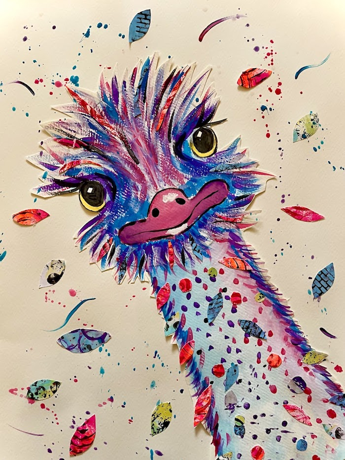
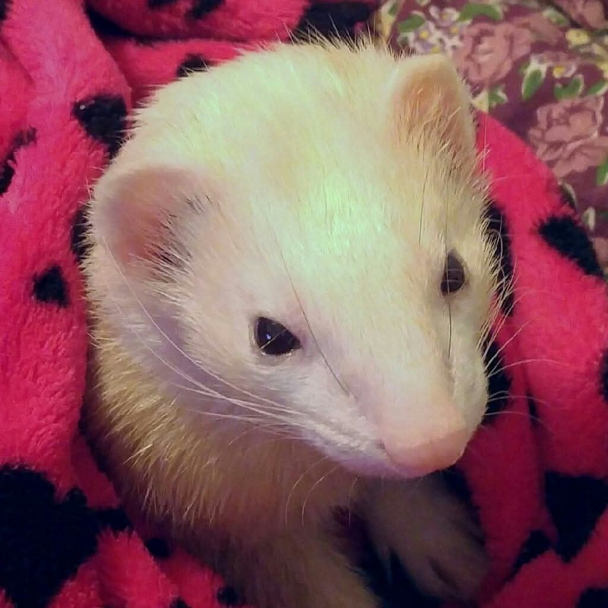
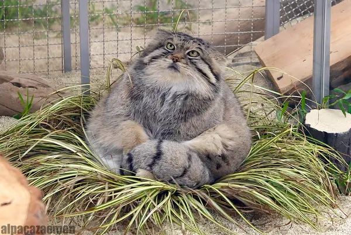
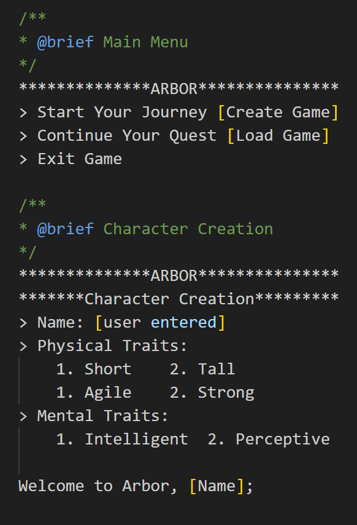
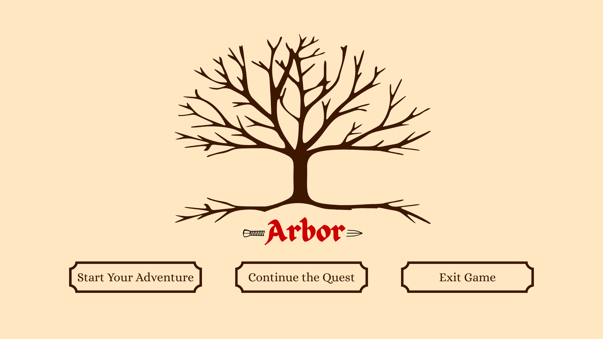
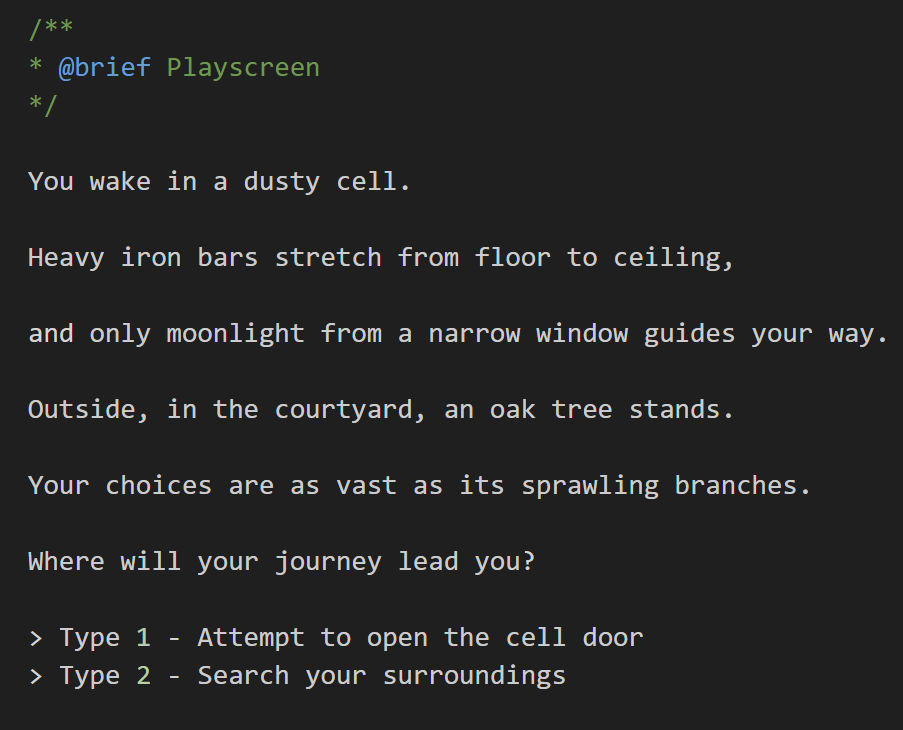
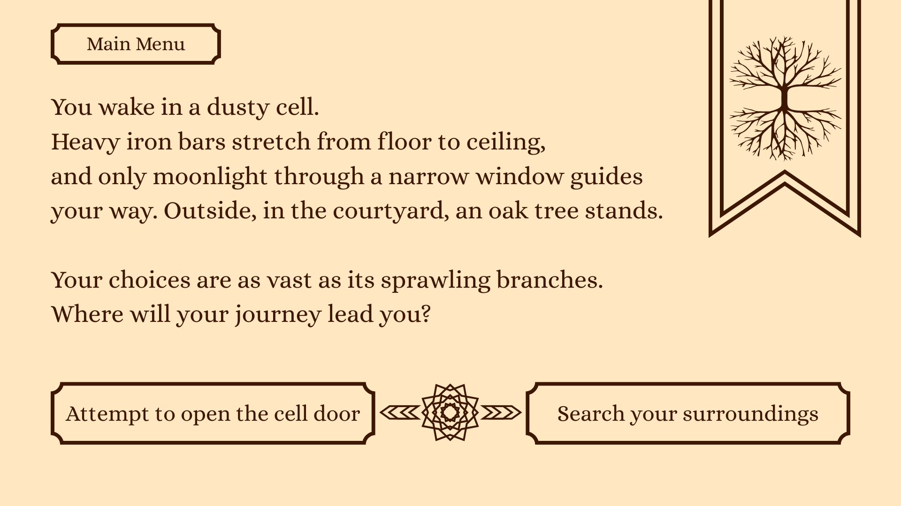

# CSCI 265 Initial Project Proposal

## Team name: PYOA

## Project/product name: code name ARBOR

## Contact person and email address

-duncan-mcleod-1996: *main contact* 
  - Lead: Project Lead
  - Understudy(s): Programming understudy
- Ka: has a chromebook...
  - Lead: 
  - Understudy(s): 
- 
- KristenM22:
  - Lead: Notetaking
  - Understudy(s): Testing
- Ma:
  - Lead: 
  - Understudy(s): 
- milutopaz:
  - Lead: Programming
  - Understudy(s): Version Control
-  Timber-faol:
  - Lead: Version Control
  - Understudy(s): Presentation

## Project Overview

Arbor is a single player, text-based game, where the user is faced with different choices that guide the overarching story. Each action the user selects has the possibility of leading them down a specific branch of the game's narrative tree, allowing them to reach good, neutral or evil endings as well as customize the path that leads them there. Arbor is aimed at users who enjoy the fantasy genre and narrative driven content.  
   
Arbor is set in a realm beset by magical unrest, rivers run green, once fertile fields have become arid, and violent storms roll across the land. The user awakes in a dungeon with no memory of how they came to be there and only a mysterious amulet to guide their way. Will they be able to recover their memories and unravel the mystery, or will they too succumb to the dark magic seeping into the land?  
   
The objective of the game is to reach one of the three main narrative conclusions. The likelihood of reaching one of these endings is based upon the quality of the user’s decisions throughout the game. For instance, when faced with gathering information from one of the game’s NPCs, does the player attempt to befriend them or coerce them? If the player is more likely to choose the former, they proceed further down the branch leading towards the “Good” ending, whereas if they choose the latter, then that would lead down the “Evil” ending branch.

## Key features and discussion

The game will be oriented around a narrative, delivered via text, that the player interacts with by making decisions at set points.These decisions will allow the narrative to branch dynamically, resulting in unique story outcomes. Further key features are as follows:

#### **Decision Tree**

* The player will move between locations, each once presenting them with options  
* At a junction there will be, at most, 3 different options the player must choose between  
* Previous decisions or the character the player chose can restrict options  
* Some decisions can lead to dead ends  
  * For instance, if a player chooses the wrong response to being attacked  
* 3 main endings (Good, neutral, evil)  
  * Decisions will lead the player down one of these paths  
* Turning Points will allow the player to change what ending path they are following

#### **Character Creation**

* The player can choose between a variety of character options before their journey begins  
  * Traits like their character’s name and pronouns  
  * Physical traits can include:  
    * Height: is the character short or tall?  
    * Agility: Can the character move with speed and precision?  
    * Strength: How much can the character use their brawn to get their way?  
  * Mental traits, for instance:  
    * Intelligence: What does the character know about the world, and how much can they figure out?  
    * Perception: How attuned are their senses to the world around them?

#### **Saving**

* The game will feature saves or “bookmarks,” which will allow the player to resume where they left off  
* Automatic saves will be made at the starting node, and each subsequent node after  
* Upon launching the game, the player will be given the choice to “Create Game” or “Continue”  
  * “Create Game” will overwrite an already existing save

**Items**

* Players can find items throughout their journey  
* Items allow players to interact with decision making and combat in new ways  
* Act as rewards to incentivise exploration and thorough play

## Preliminary interface sketches

Here are some preliminary concepts for what the game screens could look like both from a command line version and a graphical version.

The Main Menu will feature:

* Create New Game  
* Load Game   
* Exit Game

The Playscreen will feature:

* Main Menu  
* Scene Description   
* Choice Options  
* Input mechanism

Examples of Command Line and Graphical main menus:

Examples of Command Line and Graphical choice menus:

#### ## Scalable Features

#### **Randomness**

* Aspects of randomness could add replayability and variety without having to create lots of new content  
  * The order in which locations are available could be randomly shifted each playthrough  
  * The options available to players in a particular scene could be somewhat randomized as well  
* Adds an element of risk/reward

#### **Combat**

* While any combat could be simply narrated to the player, it could also be turned into an RPG system  
  * Combat encounters would have unique options available based on what kind of character is being played  
  * Players could find rewards in the form of items that could impact combat  
  * Health values, damage values, accuracy values could all be tracked as discrete statistics aside from the narrative itself  
* Different options would be available based on how the player performed in combat

#### **Graphics**

* The main intention is for a text-based game without graphics, but they could potentially be added   
  * Would increase the player’s immersion into the game

#### **Narrative**

* The narrative can shift throughout development, becoming longer or shorter depending on our resources  
* Its complexity could be adjusted as well  
  * The number of Turning Points would make the game more or less complicated  
  * The amount of Junctions and Decisions would have a similar effect

#### **Character Creation**

* The amount of options available during character creation  
  * More stats  
  * More creatures that can be played as  
* The player could choose to have the game generate a backstory for their character  
  * Backstory could be assembled from a set group of (?)  
  * Randomly generated, or based off of the traits the player picked  
  * Different backstories could affect the character’s traits

#### **Saving**

* The number of save files the player could have at any given time can be increased  
* The player could have the ability to reload from different branches  
* A tree menu would allow the navigation of a player’s decisions throughout a journey  
  * View their decisions  
  * View turning points  
  * Select a branch to reload from

## Risks and potential issues

Completing this project will present many potential issues for our team. The two main risks we are likely to encounter are related to the story line and the technical aspects of game creation.

When it comes to the story line, the size of the narrative may pose certain risks depending on whether it is too large or too small. Making the story very short and simple may make it easier to code, but it becomes less likely that the game will have enough entertainment value to keep the player base engaged. However, as the game becomes more complicated, it will be difficult to track the different branches of the story and link them together into a coherent narrative. This will make it difficult to create a final product that will be satisfying to the players.

In order to mitigate this risk, our team will begin with a basic story line and plan only one ending at a time, making sure that everything is properly connected before expanding the game and adding additional branches. This will allow us to expand the story enough to keep it entertaining, while reducing the chances of becoming overwhelmed by a complicated narrative.

The other main risk comes from the technical aspects of creating the game and the inexperience the team members have with such a project. Most of the team has little experience with programming outside of class, and the process of designing the actual structure of the game using complicated programming concepts could pose a challenge. It will also be necessary for the team to learn to use new tools that they have little to no experience with. Most games have some kind of user interface for the player to interact with rather than simply running through the console, which may be difficult to design with the team’s lack of experience using GUIs and game engines.

To deal with this risk the team will make sure to communicate regularly and support each other through learning new skills, as well as constantly exchange ideas in order to take advantage of our collective experience and creativity. We will keep our roles fluid and leverage understudies to keep any individual team member from becoming overwhelmed by the requirements of the project. 

## Target audience and motivation

The project that our team is creating is a text based adventure game that is intended to appeal both to gamers with an existing interest in retro style games looking for something with a more nostalgic feel, as well as those with little to no gaming experience. The popularity of the RPG genre shows that this is already a proven market, and our project feeds into that existing audience base. The aim for our team is to create an engaging entry-level game for a genre with rising popularity. Because our game does not rely on complex visuals and complicated gameplay that requires preexisting skills, it presents an accessible bridge to the world of gaming for those who may have a passion for reading and immersive storytelling.

Whether you're reading or playing a game, the fantasy genre has always presented the chance to escape from reality. After all, who doesn't love a daring quest? As fantasy and game lovers ourselves, our goal is to create a game that will bring our take on an epic adventure to life. By blending storytelling with re-playability, our game will allow the user to generate different story outcomes in each playthrough. 

As a junior software development team, creating a text-based game that is not heavily reliant on graphics will allow us to dive into the world of game development, while also allowing us to apply software development life cycle structure and programming tools in an engaging way.
