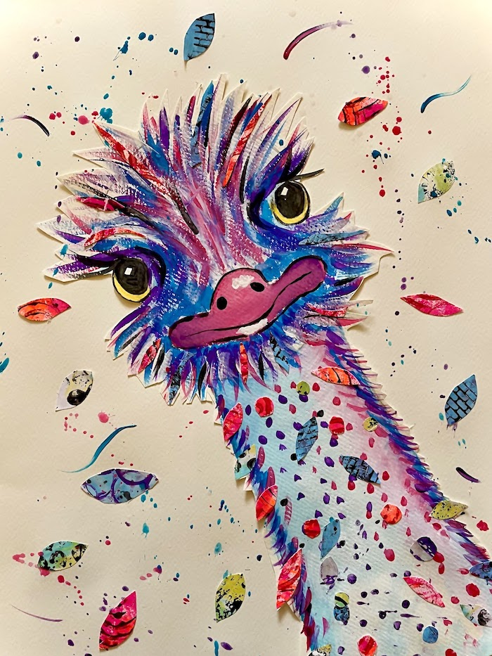
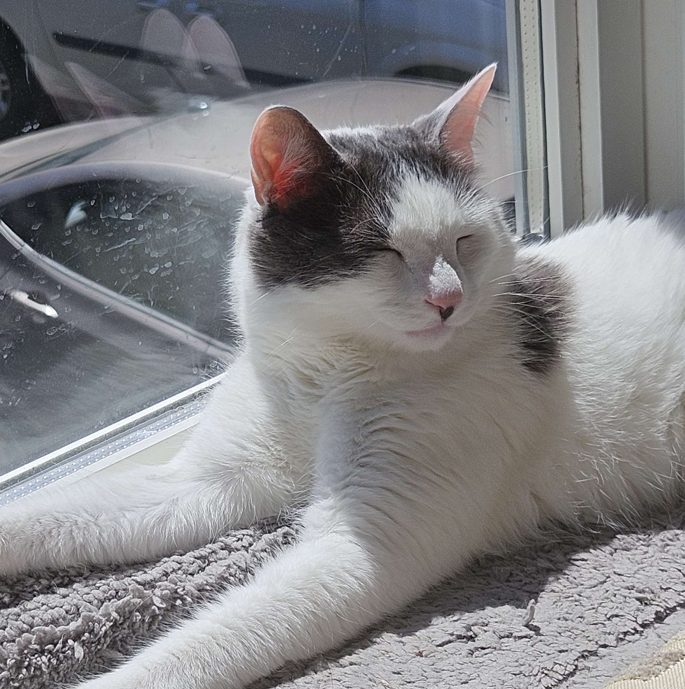
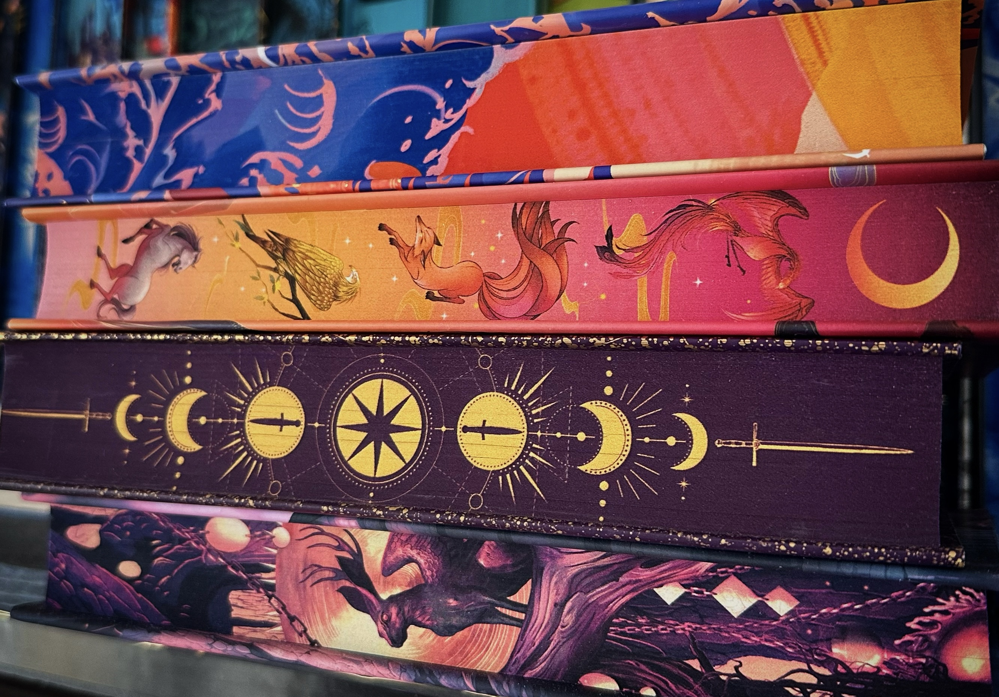
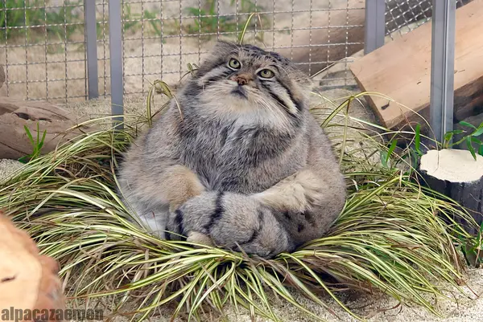
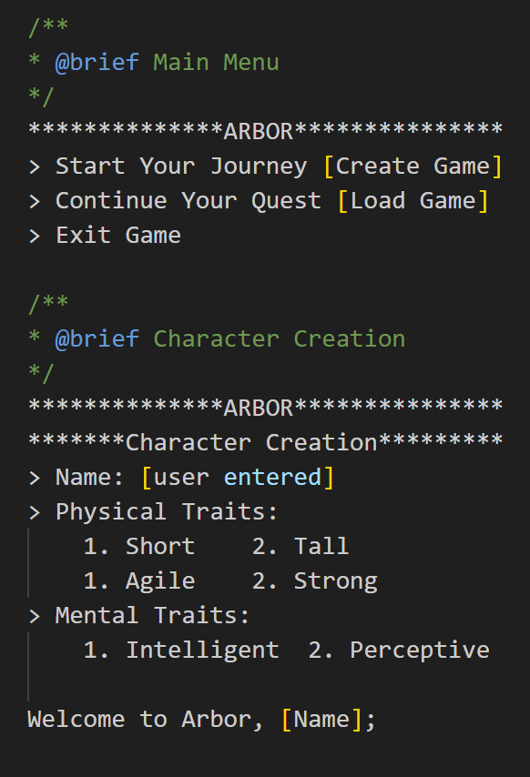
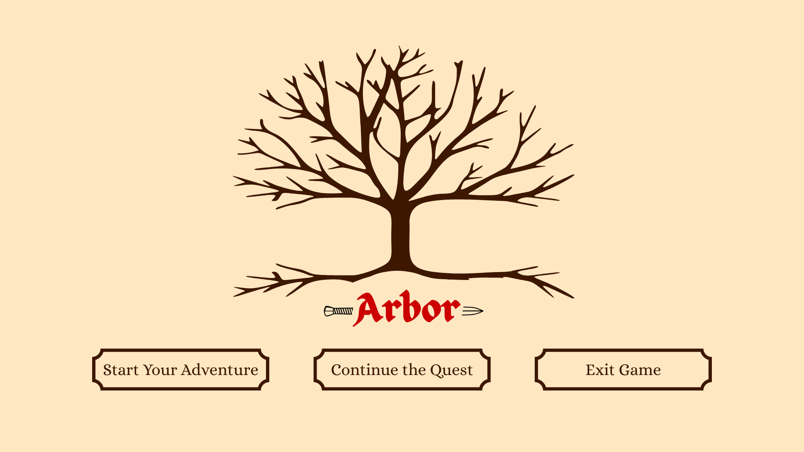
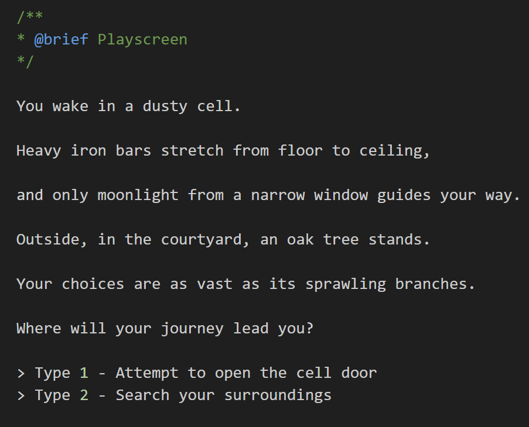
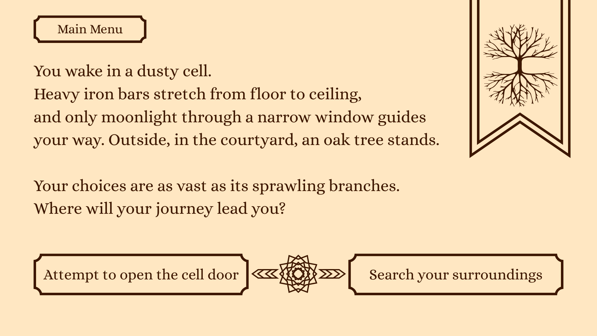

# Project name: code name ARBOR

## Team: Pick Your Own Adventure (PYOA)

## Team Members

- duncan-mcleod-1996: *main contact* 
  - Lead: Project Lead/Testing
  - Understudy(s): Programming understudy
-  kayley-m:
  - Lead: GUI 
  - Understudy(s): Creative/Narrative
-  KristenM22:
  - Lead: Notetaking
-  Ma:
  - Lead: Narrative
  - Understudy(s): Project Lead/Presentations
-  milutopaz:
  - Lead: Programming
  - Understudy(s): Version Control
-  Timber-faol:
  - Lead: Version Control
  - Understudy(s): Presentation

## Directory Structure
  ```text
  Project-Arbor
  ├───bin: executable(s).
  ├───documentation: project documents and deliverables.
  ├───images: document related images.
  ├───include: code header files.
  ├───lib: raylib library and dependencies.
  ├───resource: resources for source code to push/pull from.
  │   ├───narrative
  │   │   ├───lvl1_dungeon
  │   │   └───lvl2_tavern
  │   └───save
  ├───src: .cpp files.
  │   └───raylib: raylib specific .c/.cpp files
  └───test: contains relevant copies of code for testing.
```

## Project Overview

Arbor is a single player, text-based game, where the user is faced with different choices that guide the overarching story. Each action the user selects has the possibility of leading them down a specific branch of the game's narrative tree, allowing them to reach good, neutral or evil endings as well as customize the path that leads them there. Arbor is aimed at users who enjoy the fantasy genre and narrative driven content.  
   
Arbor is set in a realm beset by magical unrest, rivers run green, once fertile fields have become arid, and violent storms roll across the land. The user awakes in a dungeon with no memory of how they came to be there and only a mysterious amulet to guide their way. Will they be able to recover their memories and unravel the mystery, or will they too succumb to the dark magic seeping into the land?  
   
The objective of the game is to reach one of the three main narrative conclusions. The likelihood of reaching one of these endings is based upon the quality of the user’s decisions throughout the game. For instance, when faced with gathering information from one of the game’s NPCs, does the player attempt to befriend them or coerce them? If the player is more likely to choose the former, they proceed further down the branch leading towards the “Good” ending, whereas if they choose the latter, then that would lead down the “Evil” ending branch.

## Preliminary interface sketches

Here are some preliminary concepts for what the game screens could look like both from a command line version and a graphical version.

The Main Menu will feature:

* Create New Game  
* Load Game   
* Exit Game

The Playscreen will feature:

* Main Menu  
* Scene Description   
* Choice Options  
* Input mechanism

Examples of Command Line and Graphical main menus:





Examples of Command Line and Graphical choice menus:





## Target audience and motivation

The project that our team is creating is a text based adventure game that is intended to appeal both to gamers with an existing interest in retro style games looking for something with a more nostalgic feel, as well as those with little to no gaming experience. The popularity of the RPG genre shows that this is already a proven market, and our project feeds into that existing audience base. The aim for our team is to create an engaging entry-level game for a genre with rising popularity. Because our game does not rely on complex visuals and complicated gameplay that requires preexisting skills, it presents an accessible bridge to the world of gaming for those who may have a passion for reading and immersive storytelling.

Whether you're reading or playing a game, the fantasy genre has always presented the chance to escape from reality. After all, who doesn't love a daring quest? As fantasy and game lovers ourselves, our goal is to create a game that will bring our take on an epic adventure to life. By blending storytelling with re-playability, our game will allow the user to generate different story outcomes in each playthrough. 

As a junior software development team, creating a text-based game that is not heavily reliant on graphics will allow us to dive into the world of game development, while also allowing us to apply software development life cycle structure and programming tools in an engaging way.

