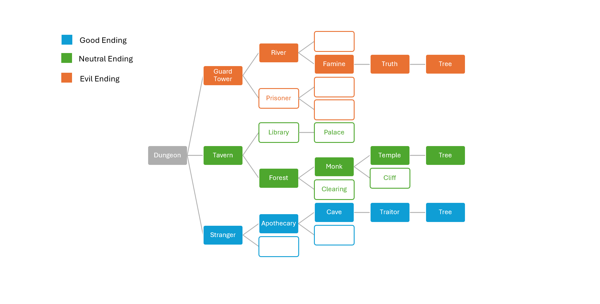

# CSCI 265 Requirements and Specifications

## Team name: Pick Your Own Adventure (PYOA)

## Project/product name: ARBOR

## Contact person: 
  - Duncan

---

# Table of Contents

1. [ Known Issues/Omissions ](#section1)

2. [ Introduction and Overview ](#section2)

3. [ Target Audience and Motivation ](#section3)

4. [ Game flow, objectives, and plot-line ](#section4)

5. [ Product Features and Behaviour ](#section5)

6. [ User Interface and Navigation ](#section6)

7.  [ Use Cases/Scenarios ](#section7)

8.  [ Non-Functional Requirements ](#section8)

9. [ Feature Prioritization ](#section9)

10. [ Glossary ](#section10)

11. [ Appendices ](#section11)

---

## 1. Known Issues/Omissions 

Section 4: “Neutral” storyline completed up until Level 4 - The Clearing. Detailed plot and levels for “Good” and “Evil” storyline are still in development.

Section 8: Non-functional Requirements still needs to be developed.

## 2. Introduction and Overview 

Arbor is a single player, text-based game, where the user is faced with different choices that guide the overarching story. Each action the user selects has the possibility of leading them down a specific branch of the game's narrative tree, allowing them to reach "Good", "Neutral" or "Evil" endings as well as customize the path that leads them there. Arbor’s target platform is PC and is aimed at users who enjoy the fantasy genre and narrative driven content.  
   
Arbor is set in a realm beset by magical unrest, rivers run green, once fertile fields have become arid, and violent storms roll across the land. The user awakens in a dungeon with no memory of how they came to be there and only a mysterious amulet to guide their way. Will they be able to recover their memories and unravel the mystery, or will they too succumb to the dark magic seeping into the land?  
   
The objective of the game is to reach one of the three main narrative conclusions. The likelihood of reaching one of these endings is based upon the quality of the user’s decisions throughout the game. For instance, when faced with gathering information from one of the game’s NPCs, does the player attempt to befriend them or coerce them? If the player is more likely to choose the former, they proceed further down the branch leading towards the “Good” ending, whereas if they choose the latter, then that would lead down the “Evil” ending branch.

## 3. Target audience and motivation 

The project that our team is creating is a text based adventure game that is intended to appeal both to gamers with an existing interest in retro style games looking for something with a more nostalgic feel, as well as those with little to no gaming experience. The popularity of the RPG genre shows that this is already a proven market, and our project feeds into that existing audience base. The aim for our team is to create an engaging entry-level game for a genre with rising popularity. Because our game does not rely on complex visuals and complicated gameplay that requires preexisting skills, it presents an accessible bridge to the world of gaming for those who may have a passion for reading and immersive storytelling.

Whether you're reading or playing a game, the fantasy genre has always presented the chance to escape from reality. After all, who doesn't love a daring quest? As fantasy and game lovers ourselves, our goal is to create a game that will bring our take on an epic adventure to life. By blending storytelling with re-playability, our game will allow the user to generate different story outcomes in each playthrough. 

As a junior software development team, creating a text-based game that is not heavily reliant on graphics will allow us to dive into the world of game development, while also allowing us to apply software development life cycle structure and programming tools in an engaging way.

## 4. Game flow, objectives, and plot-line 

As stated in the game overview, the ultimate objective for a player is to reach one of the three main narrative conclusions, “Good”, “Neutral”, or “Evil”. The core build for the game will only feature part of the “Neutral” storyline with multiple endings added in subsequent builds. A “Win” condition is that the player successfully reaches and completes the last room level. A “Lose” condition occurs when the player triggers a premature ending or “Dead End” along the way. 

In subsequent builds, the likelihood of reaching one of these endings is based upon the quality of the user’s decisions throughout the game. For instance, when faced with gathering information from one of the game’s NPCs, does the player attempt to befriend them or coerce them? If the player is more likely to choose the former, they proceed further down the branch leading towards the “Good” ending, whereas if they choose the latter, then that would lead down the “Evil” ending branch.

**Game Flow**

For the core build, players begin in the game in “The Dungeon” room and then proceed through a series of levels, referred to as rooms, culminating in “The Tree” room. To navigate through these rooms, players must read through the narrative description presented to them and then choose one of the two branching options. For instance, in the opening scene of the Dungeon the player is given the following:

You wake in a moonlit cell.

Motes of dust float through the air, flickering in and out of existence as they cross beneath the shadows of heavy iron bars.

Through a narrow window set high in the crumbling stone wall you can glimpse a courtyard and within it stands a great oak tree. 

Your choices are as vast as its sprawling branches. Where will your journey lead you?

[choice] Do you search your surroundings or try to open the door to the cell?

Each room features two junctions, where players can make decisions. While both options in the above example can lead to dead ends, the correct decision in the second junction will lead the player onto two different rooms. The diagram below highlights the pathways that the player can proceed down in the Dungeon.

If players choose incorrectly, they will receive the “Your Journey has Ended” message and then the game will load the End Game Screen. Note that players can only proceed from one room to the next and cannot traverse rooms backwards. If players complete each room successfully, they will receive a victory message and then the game will load the End Game Screen. From the End Game Screen, players can return to the Main Menu or Exit the Game.

**Plot Line**
Each of the three branches begins in the Dungeon level with the player waking to find themselves locked in a cell. They are then tasked with navigating their way out of their imprisonment; however, this is where the plot-lines diverge.

While the current state only captures the core or “Neutral” ending, as a scalable option a “Good” and “Evil” storyline are also planned. Below is a general outline of the plot for each narrative branch.

“Neutral” Ending: The player awakes in a dungeon with no memory. A mysterious amulet is their only clue to their identity. They manage to escape the dungeon with the help of a stranger with a sinister prophecy and find themselves wandering the town until they come across a tavern. 

In the tavern, they meet the barkeep. The barkeep reveals that their amulet is the symbol of the Order of the Oak. A mysterious group of knights, who once protected the land. However, little has been seen of them since magical chaos has taken hold of the land. When city guards come to the tavern, searching for the player, the barkeep helps them escape.

The player flees into the forest, where they encounter a monk and his apprentice. After saving the pair from a group of bandits, the monk shares that, in his sworn role as historian of the realm, he knows where the Order of the Oak resides.

The monk leads the player to a temple set at the foot of a tall oak tree, where the player finds signs of a fight. The player pieces together that the knights must have perished defending the tree, but something feels off. The stranger from the beginning of the story reappears and reveals that the player was indeed a knight of the order before attacking them. During the fight they reveal that the player was responsible for the deaths of the rest of the order.

By some miracle, the player survives their encounter with the stranger, but now must reconcile that they are responsible for the destruction of the order and the seeming magical chaos that runs rampant across the realm. They stumble their way to the oak tree and find a sword stabbed into its trunk. Sacrificing their magic and life, the player frees the sword from the wood and heals the tree. The land is saved.

Level 1: The Dungeon
  - The player wakes in a dungeon with no memory of how they came to be there.
  - They encounter a ghoulish stranger in the cell next to them that spins them a bizarre prophecy. 
  - When the stranger’s shouting draws the guard’s attention, they come to investigate and the stranger attacks them.
  - Together you manage to incapacitate the guards and retrieve the keys to the cell.
  - The player makes their way out of the dungeon, losing the stranger along the way.

Level 2: The Tavern
  - The player wanders through a town and comes to a tavern.
  - Inside they overhear townsfolk complaining about the harvest and the taxes from the royal family.
  - One of the villagers recognizes the player’s amulet and tells them about the order of knights sworn to protect the tree. The player can’t remember, but the villager seems to think they must be a knight if they possess an amulet.
  - The villagers encourage the player to find out what happened to the knights and why the tree has seemingly turned its back on them.

Level 3: The Forest
  - The player sets off looking for answers.
  - They follow the road from the village towards the vast forest that surrounds the tree.
  - They run into the royal guards or bandits.

Level 4: The Clearing
  - The player encounters bandits and rescues a pair of captured travellers.

Level 5: The Monk
  - After the royal carriage passes by, the player meets a monk and his apprentice. 
  - The monk reveals his connection to the Order of the Oak and helps the player find their sanctum.

Level 6: The Temple
  - The player comes across the temple clearing, recalling the first time they came across it.
  - Inside they find signs of a fight broken out, and when they come to the central chamber they remember fighting in these rooms.
  - The stranger from before reappears and attacks the player. In the scrabble the player tears off the stranger’s amulet and realizes they are a knight as well. They accuse the stranger of killing all the knights for their own gain.
  - The stranger reveals that it was not them but the player who killed the other knights.
Level 7: The Tree
  - The player makes it out of the encounter to find the tree, a sword embedded in its side, leaking dark magic. This is what is causing the chaos throughout the land, but the magic doesn’t stem from the sword, but the player themselves.
  - The player manages to wrench the sword from the tree and uses their magic to try and heal the damage they’ve caused. While the player perishes, the tree flourishes once more and the land is saved.

“Good” Ending: While this may follow a similar path to the “Neutral” Ending, where the player awakes in a dungeon with no memory. The “Good” storyline diverges in the fact that the player is able to follow a path which allows them to survive their final encounter, and heal the tree without sacrificing themselves.

“Evil” Ending: The “Evil” Ending follows the path of the player making more selfish decisions and growing to resent the realm rather than wanting to protect. Instead of choosing to heal the tree as in the “Neutral” and “Good” Ending, the player chooses to keep the power for themselves.

## 5. Product features and behaviour 

The game will be oriented around a narrative, delivered via text, that the player interacts with by making decisions at set points. These decisions will allow the narrative to branch dynamically, resulting in unique story outcomes. Further key features are as follows:

**Game and Character Creation** 
To create a new game, the player will select the appropriate option from the MAIN MENU screen. This will be done in the initial build by entering 1 in the command line. In subsequent builds, the player will be able to press the CREATE GAME button. Selecting this will lead them to the CHARACTER CREATION screen, where they can choose between a variety of character options before their journey begins.

Character Traits: The initial build of Arbor will feature the ability for the player to enter their name, which will be used in the narrative throughout the game. As a stretch goal, physical and mental traits will be considered that can impact narrative outcomes.

* Name and Pronouns: The names and pronoun option will allow a player to enter an alias for their character. Allowable inputs should be alphabetical symbols, excluding numbers and special characters. Names must not exceed 31 characters.  
* Physical Traits:   
  * Height: Players can select from SHORT or TALL.  
    * If players select SHORT, they may be able to access doors or smaller enclosed spaces.  
    * If players select TALL, they may be able to reach items inaccessible to a shorter player.  
  * Physical Skill: Players can select from AGILE or STRONG.  
    * If players select AGILE, they may be able to dodge enemy attacks or avoid taking environmental damage.  
    * If players select STRONG, they may be able to deflect or counter enemy attacks or move impassable barriers, i.e. a door or rock.  
* Mental Traits:  
  * Players can select from INTELLIGENT or PERCEPTIVE.  
    * If players select INTELLIGENT, they may have access to secure knowledge or languages that help them progress in the game.  
    * If players select PERCEPTIVE, they may be able to find hidden routes or intuit the intentions of an NPC character.

If an incorrect value is entered or the field is left blank, the game will display an error prompt and ask the player to re-enter until valid input is obtained.

**Navigating the Decision Tree**  
The player navigates through the game by choosing various options in each room. Each option will lead them towards a different ending or the next location. In the initial build, the player will use command line prompts; however, as a stretch goal we would like to incorporate a graphical interface which would allow the user to select options using buttons. For instance, the player will enter a CHOICE based on a prompt in the command line, i.e. 1 \- CHOICE A and 2 \- CHOICE B. So if the user wants to choose CHOICE A, they will enter ‘1’ in the command line and if they want to choose CHOICE B, they will enter ‘2’. 

The player will move between locations, each once presenting them with options. 3 main endings (Good, neutral, evil). Decisions will lead the player down one of these paths

Branching Points: Branching points refer to the places in the story where the player can choose between different options which will lead them down various directions in the narrative. There are two types of branching points available to the player, Junctions and Turning Points.

* Junctions: Junctions are minor decisions in a room. In the core build, players will have the option of choosing between 2 choices. These choices will not impact the overall (Good, Neutral, Bad) ending, but have the opportunity to lead to Dead Ends.  
  * For instance, if the player is faced with “1 \- Find a hiding spot,” or “2 \- Try to escape the guards.”  
    * Consider the player selects 2, then the game will load the narrative outcome for this choice. In this case, the narrative outcome is that the player is caught by the guards. A narrative description will display and then a message “Your journey has ended” is displayed.  
* Turning Points: Turning points, unlike junctions, represent major decisions that are available to players in a room. Rooms will at most have one turning point decision. These turning points have the ability to steer the player towards a different ending condition (Good, Neutral, Evil) and will also govern which Room will appear next for the player to proceed towards.  
  * For instance, when faced with gathering information from one of the game’s NPCs, the player is given the choices “1 \- Befriend” or “2 \- Coerce”.   
    * If the player selects 1, then the game loads the corresponding narrative outcome. Additionally, the game also changes what rooms are available to proceed to and by doing this alters what ending (Good, Neutral, Evil) that the player can access.   
* If a user selects an option that is not available, i.e. 3 for the previous option. The game will process the input, and then output an error message that the user has selected an invalid choice. The game will then prompt the user to re-enter their choice.

**Items** 
Items will not be available in the core build of the game. However, subsequent versions should include items that can be collected by the player. Throughout their journey, players have the possibility of finding items. These items allow players to change narrative outcomes and can act as rewards to incentivise exploration and thorough play. Items are collected through the correct sequence of choices.

* For instance, given a player is in a room and faced with a choice to search various locations. They may be asked, do you “search the dresser” or do you “search the bookcase.”  
  * If an item is available in the room, and the item is keyed to the “search the dresser”, then if the player selects  “search the dresser” they will receive the item. The game will add the item from the item resource catalog to the player’s inventory.  
  * Later on in the game, the user may be able to unlock further decisions or change the success of a decision if they have the item in their possession.

**Saving and Loading**
The game will feature saves or “bookmarks,” which will allow the player to resume where they left off. Automatic saves will be made at the starting node, and each subsequent node after. Additionally, a save will be made if the player exits the game or returns to the Main Menu.

* Save Files:   
  * Save files will store the following player information:  
    * Player Name  
    * Player Traits  
    * Room Node  
    * Item Inventory  
  * In the core build, Create a New Game will overwrite an already existing save file. However, subsequent builds may incorporate multiple save files.

* Load Game: [How do you load a game? What buttons/input is needed? What happens when you load a game?]

  * Upon launching the game, the player will select the LOAD GAME option from the main menu. When this option is selected, the game state is loaded with the saved data and the game proceeds to regular gameplay.

  * When loading a game, the player can only access the latest room node. In subsequent builds, players may be able to choose from earlier points in their save file.  
  * If the player attempts to select LOAD GAME without a save file, then the game will display an error message, i.e. “No saved game available.”

## 6. User interface and navigation 

Arbor will feature a limited amount of playscreens and menus. The following are available screens a player might navigate through during a typical game, with short descriptions for each.

* Main Menu: Game start-up screen. Interface that the player sees on launch, used to start or load gameplay.  
* Character Creation: Character customization screen. the menu that allows players to select options for their character.  
* Playscreen: The screen the player will see during actual gameplay, featuring narrative and decision options.  
* Pause Screen: The screen which allows the player to exit back to the main menu or exit game.  
* End Game Screen : Displays victory or loss message and allows users to exit back to the main menu or exit the game.

**Main Menu**

Game start-up screen. Interface that the player sees on launch, used to start or load gameplay.

* Create New Game  
* Load Game   
* Exit Game

**Character Creation**

Character customization screen. The menu that allows players to select options for their character.

* Main Menu (Back to Main Menu, does not save character details)  
* Continue (Proceeds to Gameplay)  
* Character Customization Options (Name/Physical/Mental Traits)  
  * Centred on screen with prompts on the left and input entered on the right.  
  * Each prompt displays on a separate line.

**Playscreen**

The screen the player will see during actual gameplay, featuring narrative and decision options.

* Pause  
* Scene Description   
* Choice Options  
* Input mechanism

**Pause Screen**

The screen which allows the player to exit back to the main menu or exit game.

* Resume  
* Main Menu  
* Exit Game

**End Game Screen**

Displays victory or loss message and allows users to exit back to the main menu or exit the game.

* Main Menu  
* Exit Game

**Known Omission:** *Relational Diagrams for Menu Screens*

## 7. Use cases/scenarios 

There are two core use cases for this project; case 1, where a player opts to create a new game before entering gameplay, and case 2, where a player opts to load a saved game before continuing to gameplay.

**Case 1:  Create a New Game**

A player wishes to create a new game file to play from. This situation occurs when a player starts the game for the first time or wishes to overwrite an existing save file. The player will load Arbor to the Main Menu. From the Main Menu, the player will select the CREATE NEW GAME option. 

The game will then load the Character Creation Screen which is only available when creating a new game file. On the character creation screen, the player will complete the prompts and then select CONTINUE. If the player does not wish to create a new game at this point, they can hit the BACK option. Note that hitting back at this point will erase any entered inputs for the prompts. Once the player has selected CONTINUE, the game will create a new game state for them and proceed to main gameplay. 

When the player eventually finishes a session, the game will save their progress so that it is accessible from the LOAD option at a later date.

**Case 2: Load a Game**

A player wishes to load a game file to play from. This situation occurs when a player has started the game and played previously. The player will load Arbor to the Main Menu. From the Main Menu, the player will select the LOAD GAME option. 

Once the player has selected LOAD GAME, the game will fetch the existing game file and load it into the game state for them and then proceed to main gameplay. 

When the player eventually finishes a session, the game will save their progress so that it is accessible from the LOAD option at a later date.

## 8. Non-functional requirements 

Since Arbor is a game that will be using a branching structure to navigate gameplay, there are three key non-functional requirements that the product should meet.

* Reliability:  
  * Valid Response: Each input the user enters should return a suitable response, i.e. if the input is good then the game should proceed to the next state. If the input is bad, then display an error message and ask the user to re-enter input.  
  * Error-Checking: All inputs should be error-checked to make sure they match limitations or allowable options.  
  * Predictability: The same input, should lead to the same gameplay route. The same input options for menus should lead to the correct menu.  
* Memory Management:  
  * Branching: No memory leaks. Pointers should be deleted, rooms should be disassembled after use.   
* Entertainment Value:  
  * *Known Omission:* A measurable condition for entertainment value.

## 9. Feature prioritization 

**Core Aspects**
The following must all be implemented for us to regard the project as a success:

* The main decision tree where the player makes choices to move between locations.  
* A narrative storyline.  
* Turning points that will allow the player to change what ending path they are following.  
* The game saves progress at checkpoints.

**Secondary Features**
The following are features we hope to implement, but on an "as time permits" basis:

* An expanded narrative, with more possible endings and decisions for the player to make.  
* Character trait options for the player to choose between at the start of the game, such as height, agility, strength, intelligence, and perception.  
* Items that allow the player to interact with the game in new ways.  
* Basic graphical user interface

**Stretch Goals**  
The following features are not expected to make it into our initial version of the game, but would be nice to add if things proceed smoothly and ahead of schedule:

* Expanded graphics to increase the player’s immersion into the game.  
* An RPG combat system separate from the narrative with values such as health and damage tracked as discrete statistics.  
* Randomness could add replayability and variety without having to create new content. For example, the order locations appear in or the possible options in a scene could be randomized for each play through.  
* The player could choose to have the game generate a backstory for their character, either randomly generated or based off of the traits the player picked.  
* A tree menu that would allow the player to view their decisions and turning points, and select a previous branch to reload from.

## 10. Glossary 

* Turning Points: Turning points are major decisions that can be made by the player. These choices can affect which final ending the player can attain.  
* Junctions: Junctions are minor decisions that a player can make, these decisions do not affect the final ending, but may lead to dead ends.  
* Dead Ends: Dead ends are premature endings to the game, which the player can encounter based on certain choices.  
* Decision Tree: The decision tree is the history of choices made by the player throughout the game, or within a room.  
* Branches: Branches refer to the narrative storyline and eventual ending the player is set on. For instance, if a player makes a majority of “Good” choices, then they will find themselves on the “Good” branch of the narrative.  
* Bookmarks: Bookmarks are save files that store the latest checkpoint the player has reached in the game. Most of the time this will be the current room.

## 11. Appendices 

**Known Omission** : Diagrams