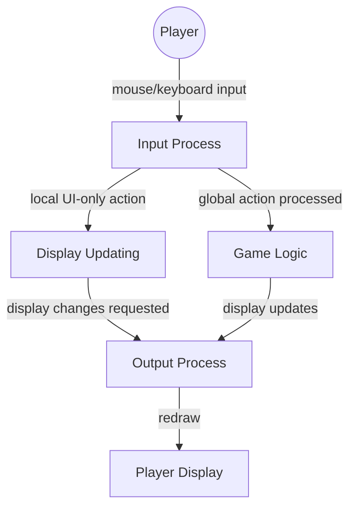
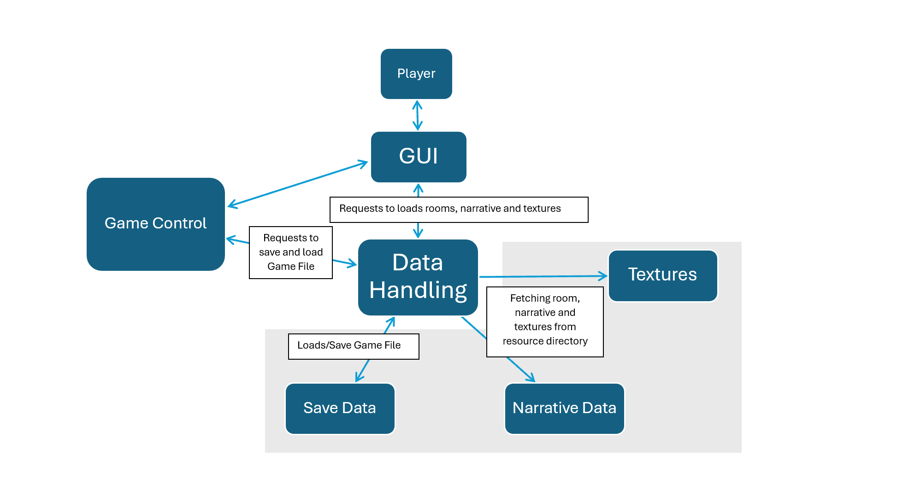
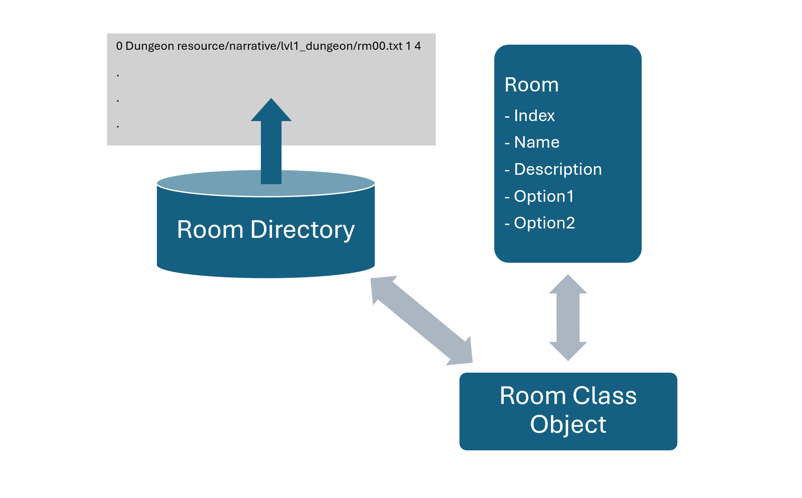

# CSCI 265 Product Design

## Team name: Pick Your Own Adventure (PYOA)

## Project/product name: ARBOR

## Contact person

duncan-mcleod-1996

# Table of Contents

1. [ Known issues/omissions ](#section1)

2. [ Product overview ](#section2)

3. [ Core design influences ](#section3)

4. [ System context ](#section4)

5. [ Architectural design ](#section5)

6. [ Module descriptions ](#section6)

7. [ Data design ](#section7)

8. [ Game state and flow of play ](#section8)

9. [ Transition to physical design ](#section9)

# List of Figures

10. [ Appendix: the grand design ](#section10)

## 1. Known issues/omissions

In this section we list any currently-known errors, omissions, or other problems with the rest of this design document.

1. Some aspects of the game that we originally planned to implement but later discarded are still depicted in the diagrams.  
2. Diagrams do not include descriptions.  
3. List of figures needs to be added.

## 2. Product Overview:

Arbor is a single player choose your own adventure game which will be played entirely on the player’s own machine. The player will enter different “rooms” of the game where they will be presented with two different options. The player will be taken to new “rooms” and different branches of the story depending on which option they choose. The player will travel through these branches until they reach either a dead end or a conclusion to the story.

Some of the main features and mechanics of the game will include:

* A GUI with images and clickable buttons, created using Raylib.  
* Game menu screens including the main menu, narrative screen, options screen, pause screen, and end game screen.  
* The ability to save and load player and game data.  
* Narrative story line data, which will be loaded into the current game level.  
* A decision tree with choices leading to different endings.

## 3. Core Design Influences:

Our overall design methodology starts with a conceptual idea for the structure of the game narrative and the decision tree. Next, it involves creating a prototype focusing on the different game objects and commands. Finally the detailed logic and code for the individual game features are created and integrated into the game.

The biggest design challenges that the developers faced while completing this project were:

* Integrating the GUI into the game  
* Room navigation and data handling  
* Integrating the save system

#### Integrating the GUI 

One of the most significant design issues the team faced was the transition from the original command-line prototype to the raylib-based graphical version of the game. Nearly all of the prototype code (ex: input handling, file loading) was written in a way that is incompatible with the functions within the graphical implementation.

##### Why couldn't the prototype code be used?   
The prototype relied on simple text based representations for rooms, menus, and descriptions. In raylib, all rendering is manual; drawing textures, text appearing within a restricted area, via UI buttons. Therefore, the team found that none of the command-line code for displaying information was compatible. As for input, the prototype was through keyboard typed input. The GUI model uses immediate input (eg. IsMouseButtonPressed(), IsKeyDown()), and requires continuous checking of each frame. The logic for loading rooms was sufficient and needed minor changes to implement in a way that was compatible with raylib.

As a result of these differences, all systems (input processing, room navigation, visual output etc.) had to be redone to operate within raylibs draw-update loop. This shift also came with implementation of a proper screen/state management system. Overall, the problem was not simply integrating raylib, but adapting the architecture of the game to the graphical environment. This redesign significantly influenced major design decisions for the project.

#### Room Navigation and Data Handling 

As a text-based game, one of Arbor’s key features is its ability to branch between different narrative options. However, as available pathways and the number of rooms in the game grow, managing the navigation between these narrative pieces becomes more complicated.

While the earliest prototype used static narrative, it became evident that Arbor needed a way to navigate through the narrative dynamically. More specifically, Arbor needed a design that would allow the game to fetch narrative, know how to get from one room to another based on the user’s input, and understand when it had reached an end game state.

To address the first goal, while keeping in mind adaptability, we designed a file input system that would read all the narrative data from the game’s Resource Directory. This allows us to make quick changes to the narrative without needing to edit the game’s source code and could in future lessen the number of resources the game needs to load at a given time. The file input system, in conjunction with a room directory also helps address how to smoothly navigate from one room to another.

Using a room directory to manage all available rooms lets Arbor hold identifiers to the specific room, room ID and name; a path to the room’s narrative, filename; and linking to subsequent rooms, the ID for the next room. For example,

`0 Dungeon resource/narrative/lvl1_dungeon/rm00.txt 1 4`

In the above example, `0` is the room ID, `Dungeon` is the room name, `resource/narrative/lvl1_dungeon/rm00.txt` is the narrative path, and `1` and `4` are the ID’s of the reachable rooms. This allows the game to tie a user’s specific input to the ID of a next room and quickly load the next stage. The room directory also lends itself to adaptability once again because it allows rooms to be deleted, added, and changed without interfering with the game’s source code.

The last challenge in room navigation and data handling was how to signal the game had reached an end state. To do this, we allocated a special room ID, `-1`, to any given “Dead End” state. This allows the game to transition to the “Game Over” screen once the narrative has been displayed.

#### Save integration 

In order to enable a save system to allow the player to close the game and resume where they left off, we used a generic serialization solution that would be able to save whatever data was needed. In the final build of the game with the GUI implemented, this system was used to save the ID of the room the player was in when the game was saved. The game will be saved when, from the main menu, the “exit” button is pressed. The game will be loaded when the “continue” button is pressed. Some issues were encountered when trying to save complex data types, especially those that contained vectors. These were circumvented by choosing to save a single int as a room ID.

## 4. System Context:

Arbor is a single player game that will be played entirely on the player’s own machine. There will be no external systems, and all interactions will be between the player and their own computer using the game’s GUI.

Data Flow Diagram - Level 0: show what external elements that interacts with Game Control or what Game control interacts with.

## 5. Architectural Design

Our system is decomposed into three core modules:

* The game control module  
* The GUI Module  
* The Data Handling Module

### The Game Control Module

Game Control involves all the systems that manage and modify the state of the game. After input is taken, game control takes it and uses it to determine appropriate output to send to the player. Game control also takes the data from the data handling module and integrates it into logic.

### The GUI Module

The GUI module is responsible for all graphical representation and user interaction within the game environment. It manages the visual layout of the game, handles real-time input, and ensures that the display matches the current stage of the game every frame. 

This includes:   
  - **Rendering Game Screens:** including title menu, gameplay screen, and end of game screen.   
  - **Handling User Input:** (Mouse and keyboard) using raylibs user input and recognition functions.   
  - **Managing the Active UI State:** depending on what screen is currently visible and transitioning between them.  
  - **Providing Graphical Components:** such as UI buttons, text boxes, and scroll bar.   

### The Data Handling Module  
The Data Handling module is responsible for all resource loading and saving for Arbor, including loading room information, room textures, and narrative description from Arbor’s resource directory, as well as saving the player’s game file to Arbor’s save directory.

## 6. Module Descriptions

### 6.1 Game Control Module 

The game control module works to update the game state using player input. Upon the game first launching, the game’s state is set to Main Menu, which informs the GUI module of what screen to display. When the input process receives valid input, for instance, when the player clicks “Start Your Adventure” from the main menu, game state will be updated so that on the next frame the GUI module will display a new screen. Using a managed and deterministic process like this ensures validity of game states and limits the possible state space for the game.

Game control does not interact with the player directly, instead it uses input validated and sent by the input process to determine what state the game should change to. During gameplay, the game control module will determine the correct room the player should be moved to, and change the current room ID variable to reflect this. In appropriate combinations of input and game state, game control tells the data handling module to save or load the current room ID.

The game starts on the main menu, in which the player is presented with three options: “Start Your Adventure,” “Continue the Quest,” and “Exit Game.” The start button sets the current room ID to 0, or the first room, and sets the game state to gameplay. Continue loads a save file, then uses the room ID contained within as the new current room ID, then updates game state to gameplay. “Exit Game” saves the current room to a file and closes the game. 

During gameplay, the player is presented with a “Menu” button and 2 options. The player will use the narrative context to choose and options which, when clicked, will update the current room ID to their corresponding room. If the selected option’s ID is -1, the player will be shown the exit screen, but their current room will not be changed.. If the player presses the “Menu” button, the game’s state will be returned to menu. Notably the current room ID is not reset upon returning to the main menu, so exiting from here will save the player’s progress.

The exit screen features a “Main Menu’ button, and an “Exit” button. Menu will return the game state to the main menu, and exit will simply close the game. Since the current room ID will remain at whatever room precedes the end state, exiting the game after reaching the end screen will save that preceding room’s ID.

### 6.2 The GUI Module

The role of the GUI (UIX) module is to manage all the direct interaction between the player and the system. This includes capturing player inputs (mouse clicks, keyboard presses, scroll wheel movement) and controlling all means of presenting information to the player (game screens, dialogue text, buttons, and other visual components).

This module also defines the interaction boundaries of the screen, including the dedicated text display area and scrollable content region used for our room descriptions. 

For captured player input, the GUI module is responsible for basic validation (e.g., ensuring the mouse click occurs within a defined button region) and then forwarding the action in a structured format to the game logic layer (GameManager). For output, the GUI relies on the internal state provided by the game logic (current room, current game state, associated description etc.) to determine what should be drawn each frame.

Certain player inputs, (e.g. using the scroll wheel inside the specified text region) are recognized as having strictly local UI effect, which means they are processed entirely within the GUI and do not require game state updates. 

The elements of the GUI module and their relationships with other system components are represented conceptually below:

#### 6.2.1 The Input Process

The input process detects all player interaction events supported by Arbor (via keyboard and mouse). It must detect user action, validate it, and then trigger the required processing, either local UI or game state altering changes.

Arbor’s user input process includes the following:

  - Mouse button presses (used for menu and gameplay option selection)  
  - Mouse position (used to detect button collision)  
  - Scroll wheel movement (for manually scrolling text)  
  - Keyboard presses (arrow keys as alternate scrolling method)

It's responsibility is to:  
  1. Detect a player choice  
  2. Validate the choice based on the context (current state, valid button regions, etc.)  
  3. Convert the action into a structured message (GUI option, e.g. \`OPTION\_A\`)  
  4. Forward the message to either  
      - to Game Manager when the option drives game progression  
      - or directly to the display update routine for local updates (text scrolling, etc.)  
      
**Anticipated Action Sequence**

The GUI input process repeats the following:

##### 1. Check for new input  
  - Detect mouse clicks.  
  - Detect scroll wheel movement.  
  - Detect arrow-key presses for additional scroll support.

##### 2. Process the new input  
  - Validate (e.g., ensure click is inside option button region, or scrolling is within the boundaries etc.)  
  - Identify and encode a GUI choice if applicable  
      - `OPTION_A`, `OPTION_B`, `MENU`, etc.  
  - Route the message  
    - If it affects the gamestate -> forwarded to Game Manager  
    - If strictly local -> handled internally by GUI

The input process is implemented primarily through `Button::checkMenuInput()`, `ButtonManager::checkGameInput()`, etc. and scroll detection in the `Draw()` or `Update()` loop.

#### 6.2.2 The Output Process

The output process is responsible for rendering all visual elements to the screen each frame. This includes:

  - Switching between the menu, gameplay and end screens.  
  - Drawing button regions and allowing them to visibly respond to input  
  - Displaying room text inside the defined scrolling region  
  - Applying scrolling offsets when text exceeds its container height  
  - Redrawing the display after each modification

##### Responsibilities of the Output Process

  - Draw appropriate background textures (menu, gameplay, end)  
  - Render text retrieved from the `RoomManager`  
  - Apply text wrapping to fit the designated text box width  
  - Apply scrolling offset (`scrollOffset`) when text is taller than the box  
  - Ensure the buttons remain clickable  
  - Prevent drawing outside the scrollable region

**Anticipated Action Sequence**

The output loop repeats the following:  
  1. Check if display needs updating  
      - this occurs every frame in raylib  
  2. Process update / draw  
      - Determine which game state is active  
      - Identify the required visual changes  
      - Redraw the room text with the current wrapping and scroll offset  
      - Redraw the buttons

This corresponds to the `Draw()` function, as well as delegates input handling to `Update()`, and text drawing to the internal routine. 

#### 6.2.3 The Display Data Updating

The rendering decisions in the Arbor's GUI are driven by:  
  - The current game state (`MENU`, `GAMEPLAY`, `END`)  
  - The currently loaded room and its description text  
  - The scroll offset for the text region  
  - Button Manager's interactions for menu and option choices

Changes originate from Game Manager, which acts as the logic:  
  - When a player selects an option button, `GameManager` updates `currentRoom`.  
  - When switching screens, `GameManager` updates `currentStage`.  
  - When a room's description is loaded, `GameManager` instructs the GUI to redraw the wrapped text.

The display update happens continuously but is fully determined by the most recent logic-state provided by the Game Manager.

### 6.3 The Data Handling Module  
The Data Handling module is responsible for all resource loading and saving for Arbor, including loading room information, room textures, and narrative description from Arbor’s resource directory, as well as saving the player’s game file to Arbor’s save directory.

#### 6.3.1 Data Handling Module Design Diagram

#### 6.3.2 Room Information Loading  
The room information loading system is aimed at loading the list of playable rooms from Arbor’s resource/narrative directory to help construct rooms within the game. Upon launching Arbor, the Game Manager system uses file reading to pull information from the directory and assign it to Arbor’s room class system, using RoomManager::loadRooms().

The room class system is used by the Game Manager to navigate between rooms based on user input.  
	  
#### 6.3.3 Room Texture Loading  
The room texture system loads each of Arbor’s game screens from the resource directory, using RoomManager::getRoomTexture() and communicates with the GUI system to update and render the correct menu for the player. 

The following room textures are currently available as displayable screens:

- Main Menu   
- Game Play Screen  
- Game Over Screen

#### 6.3.4 Narrative Description Loading  
Narrative information is loaded using the room directory system and `RoomManager::loadRooms()`. Each room’s narrative is stored in its own file and organized under the room’s specific sub-directory. 

`RoomManager::loadRooms()`’s file reading system pulls the narrative from the text file one line at a time and inserts new lines in between to properly display them for the player in the GUI.

#### 6.3.5 Save File Loading  
The save file system reads and writes to the game’s save directory. The Game Control system calls `save_system::save_object()` when a player selects “Start Your Adventure” and exits during gameplay. The save system saves the index of the current room, so that the game can be reloaded, using `save_system::load_object()` from the “Continue Your Journey” option on the main menu. 

If there is an existing save, the save file system overwrites it if a new game is created.

## 7. Data Design

The data that will be used in our game will be divided into the following categories:

* Room Data  
* Image Data  
* Save Data

### 7.1 Room Data

The game will have files containing information for each room that the player can encounter. The room data will include:

* Unique ID  
* Room name  
* Narrative text block containing the narrative story line of the room and the text for the two options that can be selected in the room  
* Two integers to represent the rooms that can be accessed based on the player’s choice.

### 7.2 Image Data

Image data will include all the images that will be loaded and displayed in the Raylib GUI. The images that will appear in the game include:

* gameplayScreen.png  
* mainMenu.png  
* endScreen.png  

### 7.3 Save Data

* The game saves the room directory.

Entity Relation Diagram: shows the data flow between the various entities.

## 8. Game state and flow of play:

The player will begin the game on the main menu screen, where they will have the option to either start a new game or load saved data from an existing play through. If the player chooses to load a saved game, they will be taken to the point of the game where they left off last. If the player chooses to begin a new game, they will be taken to the gameplay screen where they will be presented with text introducing them to the game’s story line, and two options for them to choose from. The player will be able to click either option one or option two, and they will then be advanced to the next room where they will encounter a new block of text with the continuation of the story and a new pair of options. 

As the player makes choices and moves through the game, they will be led along different paths in the story, eventually coming to either a dead end where they will need to begin the game again, or to one of the main conclusions of the story. If the player reaches a dead end or one of the story’s main endings, they will be taken to the The End screen, which will display a message and give the player the option to return to the main menu.

State progression through the game:

1. Main menu screen  
   * Choose between start new game and load.  
2. Game play screen  
   * Narrative text  
   * Options 1 and 2  
3. The End screen  
   * The End message  
   * Return to main menu

State Diagram: this shows the various states the gamer can be in and how they can get to them.

## 9. Transition to Physical Design

Core Implementation Decisions  
Our team has decided to implement our program using c++. We made this decision because c++ is the only programming language that all team members have experience with, and learning another language in the limited time we have during the semester would be challenging and slow down the production of the game.

We originally considered using game engines for the implementation of the GUI, but ultimately decided on Raylib. Using an existing library has a much more manageable learning curve for the team than having to learn to use a complicated game engine.

Some other implementation decisions our team made for this project include:

* Using pointers without worrying about ownership to keep the project from becoming unnecessarily complex.  
* Storing data in vectors and deleting it at the end of the program. This decision was made as a result of using pointers and provides an easy way to manage memory.  
* Using public inheritance for the command system in order to have a generic command object and change functionality at runtime.

## 10. Appendix: the Grand design

Data Flow Diagram - Level 1: provides more details of the external entites from the level 0 DFD. Provide some internal processes of Input stream and Game Control. (This was a early design and may not accurately reflect current Arbor processes.)

